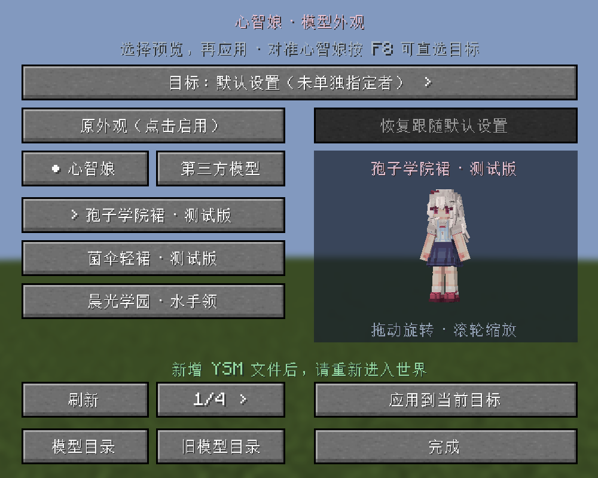

# SporeAI 心智娘模型社区

心智娘 YSM 模型分享、二次创作与投稿仓库，由霜星维护。

本仓库开放模型资源，不包含 SporeAI 主模组或外观附属的 Java 源码、构建工程和源码压缩包。

## 下载与使用

[下载外观附属与心智娘模型包](https://github.com/sx050907-png/SporeAI-MindGirl-Models/releases)

- 外观附属：`spore_ai_ysm-1.0.0-beta.1.jar`，放入客户端 `mods` 文件夹。内含 10 套心智娘与九灾厄及其状态，共 67 个模型目录。
- 仅心智娘模型：下载 `SporeAI-MindGirl-Models-1.0.0-beta.1.zip`，将其中 10 个模型目录解压到 `config/yes_steve_model/custom/`，避免多套一层目录。
- 需要 Minecraft 1.21.1、NeoForge 21.1.248+、Java 21、SporeAI 2.8.0-beta.1+ 与 YSM **2.6.5-neoforge+mc1.21.1**。主模组的 Spore 等依赖照常需要。
- 首次进入世界等待 YSM 编译、同步后按 F8，选择心智娘模型。未安装 YSM 时 F8 不打开外观界面。
- 附属自动安装模型；同名本地模型存在修改时整套保留。采用新版本前可把对应旧目录移到 `custom` 外备份，勿清空第三方模型。卸载附属不会自动删除已导出的模型。

## 当前模型

温柔共生 v1、温柔共生发饰版 v2、春日共生、菌花巡游、暮色守望、绯樱和风、晨光学园、林间旅装、菌伞轻裙、孢子学院裙。

查看 [模型介绍](docs/模型介绍.md) 与 [模型目录](models/official)。九灾厄完整模型随附属 JAR 提供。

## 投稿

欢迎原创心智娘服装、发饰与孢子主题模型！请先阅读 [投稿协议](CONTRIBUTING.md)。

推荐 Fork 后把模型放入 `models/community/<作者>/<模型ID>/` 并提交 Pull Request。不会使用 Git 的作者可以通过 [模型投稿 Issue](https://github.com/sx050907-png/SporeAI-MindGirl-Models/issues/new?template=model-submission.yml) 提交文件下载链接、预览和授权信息。投稿经维护者审核后收录，不自动进入附属发行版。

## 作者与许可

当前收录改作基于酒狐模型，原模型作者：**完美冻结**；角色及服装改作：**霜星**。动画、材质等完整原始贡献记录在每套模型的 `ATTRIBUTION.json` 内，展示作者列表不替代完整署名。

模型采用 [CC BY-NC-SA 4.0](https://creativecommons.org/licenses/by-nc-sa/4.0/)：署名、非商业、相同方式共享，并说明修改。遵守原作者与第三方素材授权，不把投稿视作转让著作权。

附属成品保留其内部许可：模型 CC BY-NC-SA 4.0，安装器 MIT。本仓库不发布模组程序源码，也不以仓库开放改变已有许可。详见 [许可范围](LICENSE.md)。

## 验证范围

当前发行候选已有 2468 项自动测试通过记录。实机验证覆盖 F8 可选联动、首次加载 67 个目录和学院裙曲柄动作；未完成多人全流程、全部灾厄战斗与损伤状态及所有动作穿模回归。最新署名与介绍修订仅重新构建打包，未重复实机验收。
